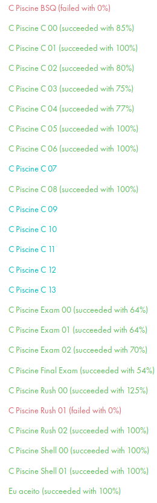

# Piscine 42 from Sao Paulo Brasil
## Skills
* Logic
* Curiosity
* Determination
* Perseverance
* Autonomy
* Social
## Languages
* C
* Shell
## Tips
* Do not spend too much time on C00 & C01
* Register for all the rushs and try, you will learn a lot
* Do your best and work as a team for the rushs
* Sleep early the night before an exam, especially for the last one
* Do not go in evaluation if you do not understand perfectly your code
## Preparation
* Learn the basic of Shell
* Learn the bacics of Git
* Learn to use Vim or Emacs
* Learn the basics of C
## Grades

